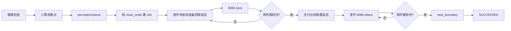

# Agent 工作流与接口说明

> 本文按当前代码整理，描述已经实现的主 Agent 和 8086 独立取放服务。原始能力接口约定仍见[能力模块划分与 Agent 接口规范](./能力模块划分与Agent接口规范 .md)。运行命令见项目根目录 [README](../README.md)。

## 1. 当前实现结论

|部分|当前实现|
|---|---|
|主 Agent|`src/agent` 使用 LangGraph 编排 `SORTING`、`SHORTAGE`、`MISPLACED`，不实现导航、视觉、姿态或抓放算法|
|主流程取放|统一调用 8086 的 `POST /pick` 和 `POST /place`|
|8086 服务|`src/pick_place_service` 是独立 HTTP 服务，内部串联 8083、8084、8085 完成一次取放子流程|
|商品名|小票返回商品名后，通过商品库 `GET /sku/search_by_name` 解析标准货位；`route_order` 只决定分拣取货顺序|
|视觉接口|小票识别使用 `POST /perception/parse`，货架识别使用 `POST /perception/inspect`|
|巡检拍摄|每个巡检点先导航成功，再依次使用 `SHELF_VIEW_UPPER` 和 `SHELF_VIEW_LOWER` 拍摄并识别上下半部|
|状态保存|State 只在当前进程内存中，未配置持久化 checkpoint 或跨进程机器人锁|

> 现场接口状态：8083 的 `/perception/inspect`、放置定位接口以及 8084 的 `/manipulation/release` 当前仍标记为缺失或未调通。任务二、任务三依赖 `/perception/inspect`；任务一的抓取已通过 8086 `/pick` 调通，放置需以 8086 `/place` 的现场联调结果为准。

## 2. 代码入口和目录职责

|文件或目录|职责|
|---|---|
|`src/agent/main.py`|读取任务类型和 YAML，创建 State、Client 和 LangGraph，执行 `run_task`|
|`src/agent/models.py`|`WorkflowState`、`Job`、任务枚举、配置模型和错误类型|
|`src/agent/client.py`|调用导航、感知、姿态、商品库和 8086；统一响应校验、超时、一次网络重试和幂等键|
|`src/agent/workflow.py`|公共节点、三张工作流图、作业生成、循环和失败路由|
|`src/agent/mock_server.py`|8101-8104、8106、8107 的独立联调 Mock|
|`src/pick_place_service/app.py`|8086 FastAPI 路由、健康检查和请求幂等缓存|
|`src/pick_place_service/service.py`|8086 下游 HTTP 调用、相机取帧、掩码生成和子流程编排|
|`config/agent*.yaml`|主 Agent 的服务地址、巡检点、超时和商品货位表|
|`config/pick-place.yaml`|8086 的 8083/8084/8085 地址、相机、标定文件和超时|

主 Agent 的程序入口是 `run_task(task_type)`；命令行由 `scripts/run-task.sh` 调用。8086 的程序入口是 `python -m pick_place_service`，默认监听 `0.0.0.0:8086`。

## 3. State、Job 和公共执行规则

### 3.1 State

|字段|用途|
|---|---|
|`task_run_id`、`task_type`、`status`|任务标识、任务类型和 `RUNNING/SUCCEEDED/FAILED` 状态|
|`inspection_points`、`inspection_index`、`inspection_pass`|巡检点游标和正反向轮次|
|`findings`|小票或巡检得到的货位列表|
|`jobs`、`current_job_index`|待搬运作业及当前游标|
|`held_items`|`LEFT/RIGHT` 手当前持有的商品|
|`current_action_id`、`current_action_status`|最近物理动作和 `IDLE/RUNNING/SUCCEEDED/FAILED/UNKNOWN` 状态|
|`error_code`、`error_message`|失败原因|

每次运行创建全新的 State。节点返回局部更新，不原地修改列表或字典。只有能力接口明确返回成功，代码才会把 Job 标记为 `picked/placed=true`，更新或清除 `held_items`。

### 3.2 健康、失败和结束

任务开始并发检查导航、感知、姿态、商品库和 8086；全部为 `READY` 才进入业务节点。任一节点失败都路由到 `fail`，不再发起新的物理动作。`finish` 会确认所有 Job 已放置且双手为空，然后导航到 `task_boundary`；该导航成功后才进入 `SUCCEEDED`。

### 3.3 超时、重试和幂等

主 Agent 对连接或读取异常最多重试一次，明确的非 `2xx`、非法 JSON 或响应字段错误不重试。导航、姿态、抓取和放置使用稳定的：

```text
Idempotency-Key: <task_run_id>:<action_id>
```

同一动作重试复用同一个键。两次网络异常后，物理动作状态为 `UNKNOWN`，错误码为 `ACTION_RESULT_UNKNOWN`，任务停止等待人工确认。服务端需要按幂等键返回原执行结果，不能重复执行真实动作。

## 4. 主 Agent 直接调用的接口

|服务|默认生产地址|接口|用途|
|---|---|---|---|
|商品库|`192.168.130.59:25540`|`GET /sku/health`|健康检查|
|商品库|同上|`GET /sku/search_by_name?name=...`|按商品名查询标准货位|
|商品库|同上|`GET /sku/search_by_location?location=...`|按货位查询商品信息|
|商品库|同上|`GET /sku/images`，JSON body `{"name":"..."}`|查询商品图片（Client 已封装）|
|导航|`192.168.130.59:8081`|`GET /navigation/health`、`POST /navigation/navigate`|健康检查和移动到命名点位|
|姿态|`192.168.130.59:8082`|`GET /pose/health`、`POST /pose/prepare`|健康检查和准备 `RECEIPT_VIEW`、`SHELF_VIEW_UPPER`、`SHELF_VIEW_LOWER`、抓取/放置等姿态|
|视觉理解|`192.168.130.59:8083`|`GET /perception/health`、`POST /perception/parse`|健康检查和识别小票货位|
|视觉理解|同上|`POST /perception/inspect`，JSON body `{"task_type":"SHORTAGE"}` 或 `{"task_type":"MISPLACED"}`|巡检缺货或乱放货位|
|取放编排|`192.168.130.59:8086`|`GET /health`、`POST /pick`、`POST /place`|健康检查和一次完整取放子流程|

8086 的 `/pick`、`/place` 请求字段为 `task_type`、`product_name`、`hand`，可选 `product_type`；主 Agent 传递大写 `LEFT/RIGHT`，8086 接受大小写并转为下游所需的小写。

## 5. 三类工作流

### 5.1 `SORTING` 商品拣选



|步骤|代码节点|主要调用|状态变化|
|---:|---|---|---|
|1|`check_health`|5 个依赖的 health|全部就绪后继续|
|2|`prepare_receipt`|先导航 `receipt_viewpoint` 成功，再准备姿态 `RECEIPT_VIEW`|到达小票观察位|
|3|`parse_receipt`|`POST /perception/parse`|要求恰好两个不同商品名；随后由 SKU `/sku/search_by_name` 解析为两个不同标准货位|
|4|`build_sorting_jobs`|商品库 `/sku/search_by_name` 查询并校验唯一货位|按 `route_order` 排序，第一件左手、第二件右手|
|5|`prepare_sorting_pick`|先导航货位成功，再准备 `SHELF_PICK_READY`|准备当前货架层|
|6|`pick_current`|`POST /pick`|成功后更新 `picked` 和持物手|
|7|`prepare_delivery`|先导航 `delivery_place` 成功，再准备 `DELIVERY_TABLE_PLACE_READY`|进入放置循环|
|8|`place_current`|`POST /place`|成功后更新 `placed` 并清空手|
|9|`finish`|导航 `task_boundary`|成功才结束任务|

### 5.2 `SHORTAGE` 货架补货

```mermaid
flowchart LR
    A[健康检查] --> B[导航巡检点]
    B --> C[SHELF_VIEW_UPPER + 上半部识别]
    C --> D[SHELF_VIEW_LOWER + 下半部识别]
    D --> E{累计两个货位?}
    E -- 否 --> B
    E -- 是 --> F[生成补货 Job]
    F --> G[补货台连续两次 /pick]
    G --> H[逐货位导航和放置姿态]
    H --> I[/place]
    I --> J{两件都完成?}
    J -- 否 --> H
    J -- 是 --> K[task_boundary]
    K --> L[SUCCEEDED]
```

巡检第一轮按 `inspection_points` 正序，第二轮逆序，之后往返。每个巡检点先导航成功，再依次准备 `SHELF_VIEW_UPPER`、识别上半部，准备 `SHELF_VIEW_LOWER`、识别下半部；两次结果在 Agent 内按出现顺序合并去重。新一轮首点就是上一轮末点，不重复导航，但仍重新执行上下两个拍摄姿态和识别。少于两个继续巡检，单次或累计超过两个失败。两个缺货位按发现顺序分配左右手，商品名由商品库查询，来源固定为 `replenishment_pickup`。

### 5.3 `MISPLACED` 乱放归位

视觉接口在每个巡检点分别返回上下半部结果，代码合并后解释数组 `[P1, P2]` 为：P1 是错误货位，P2 是该商品的标准货位。流程严格固定为“左抓 P1 -> 右抓 P2 -> 左放 P2 -> 右放 P1”。所有导航和姿态准备均按“导航成功后再调整姿态”执行。P2 抓取结束后已经在 P2，左手放置阶段只调用姿态准备，不重复导航；右手放置前再导航回 P1 并准备姿态。

|Job|商品名|来源|目的地|手|
|---|---|---|---|---|
|`job_0`|P2 货位的商品名|P1|P2|LEFT|
|`job_1`|P1 货位的商品名|P2|P1|RIGHT|

## 6. 8086 取放服务内部流程

8086 对外只暴露 `/health`、`/pick`、`/place`。每个动作必须带 `Idempotency-Key`；同一进程中相同键和相同请求会等待并复用同一个复合流程结果，复用键但请求体不同返回 `409 IDEMPOTENCY_KEY_CONFLICT`。

|阶段|`/pick`|`/place`|调用接口|
|---|---|---|---|
|1. 定位|定位抓取目标|定位放置区域|8083 `POST /perception/pick/locate` 或 `/perception/place/locate`|
|2. 取图|根据 bbox 生成掩码|同上|8085 `GET /camera/snapshot?camera=...&type=color`；`GET /camera/stream?camera=...&type=depth` 取第一帧|
|3. 位姿|估计抓取位姿|估计放置位姿|8084 `POST /manipulation/pick_pose` 或 `/manipulation/place_pose`|
|4. 执行|抓取|释放|8084 `POST /manipulation/grasp` 或 `/manipulation/release`，携带内部幂等键|
|5. 校验|视觉确认抓取|视觉确认放置|8083 `POST /perception/pick/check` 或 `/perception/place/check`|

8086 的健康检查会检查 8083 `/perception/health`、8084 `/manipulation/health`、8085 `/camera/health`，并要求 8085 `/camera/list` 请求成功。位姿请求使用临时 RGB、depth、camera 标定文件和 PGM mask 文件；流程结束后清理临时目录。

## 7. 配置和当前限制

|配置|作用|
|---|---|
|`config/agent.production.yaml`|生产：商品库 25540，能力服务 8081-8084，8086|
|`config/pick-place.yaml`|8086 下游 8083/8084/8085、相机、标定文件、临时目录|

需要现场确认或维护的限制：

1. 商品库查询当前按约定使用 `GET + JSON body`；经过不转发 GET body 的网关时需要和商品库服务统一改为查询参数。
2. `route_order` 是配置中的静态顺序，不是导航服务实时计算的最短路径。
3. State 和 8086 幂等缓存均为单进程内存；进程重启后不能恢复，跨进程同时启动任务也没有锁。
4. 8086 依赖相机返回可解析的 color 图像和至少一帧 depth 数据，并要求 `calibration_files` 中当前相机对应的标定文件在服务进程可读。
