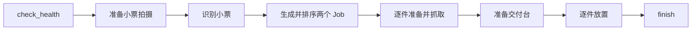
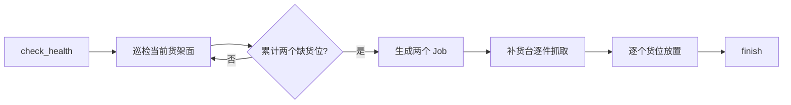
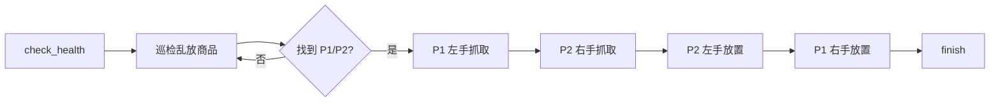

# Agent 编排模块 LangGraph 简化开发文档

> 依据：[能力模块划分与 Agent 接口规范](./能力模块划分与Agent接口规范.md)  
> 开发范围：State、任务规则、作业生成、流程路由、能力接口调用  
> 测试方式：导航、场景理解、位姿控制、抓放模块全部使用 Mock HTTP 服务

## 1. 开发目标

使用 LangGraph 实现三个固定任务：

1. `SORTING`：商品拣选。
2. `SHORTAGE`：货架补货。
3. `MISPLACED`：乱放归位。

Agent 只负责编排，不实现导航、视觉、位姿和抓放算法。三个任务规则已经确定，因此不引入 LLM。

本阶段不实现：

- Agent 对外 Web API。
- 数据库和进程崩溃恢复。
- ROS 调用。
- 多机器人、多任务并发。
- 复杂日志、指标和分布式部署。

程序通过 `run_task(task_type)` 启动一个任务。同一进程一次只运行一个任务。

## 2. 技术栈

|依赖|用途|
|---|---|
|Python 3.11+|运行环境|
|LangGraph 1.x|状态流转和条件路由|
|Pydantic 2.x|配置、请求和响应校验|
|httpx|异步 HTTP 调用和 MockTransport|
|pytest + pytest-asyncio|自动化测试|

首版使用 LangGraph 内存状态，不配置 checkpointer。

## 3. 简化代码结构

```text
robot_games/
├── pyproject.toml
├── config/
│   └── agent.yaml
├── src/agent/
│   ├── __init__.py
│   ├── models.py        # State、Job、配置和接口模型
│   ├── client.py        # 四个能力模块的 HTTP 调用
│   ├── workflow.py      # 任务规则、节点、路由和图构建
│   └── main.py          # run_task 入口
└── tests/
    ├── mock_services.py # 模拟四个能力模块
    └── test_workflow.py # 三个任务及异常测试
```

不再为每个任务、Client、Node 建立独立目录。代码增加到难以维护时再拆分。

## 4. 配置

```yaml
# config/agent.yaml
services:
  navigation: http://navigation.local
  perception: http://perception.local
  pose: http://pose.local
  manipulation: http://manipulation.local

inspection_points:
  - H1_F_INSPECT
  - H1_B_INSPECT
  - H2_F_INSPECT
  - H2_B_INSPECT

timeouts:
  connect_seconds: 3
  health_seconds: 5
  receipt_seconds: 120
  inspection_seconds: 180
  navigation_seconds: 600
  pose_seconds: 300
  pick_seconds: 600
  place_seconds: 600

product_slots:
  H1_F_L1_C01:
    product_name: 可口可乐
    route_order: 1
  H1_F_L1_C02:
    product_name: 矿泉水
    route_order: 2
```

商品货位表必须包含比赛使用的全部货位。Agent 从货位编号派生：

- 导航点：`target_id = product_slot_id`。
- 货架层：例如从 `H1_F_L3_C02` 得到 `L3`。
- 商品名：从 `product_slots[product_slot_id].product_name` 查询。

启动时检查货位编号格式、商品名、`route_order`、巡检点非空且不重复，以及全部超时配置。配置非法时不开始任务。

上述超时是初始值。实机联调时统计各接口最长耗时，并在最长耗时上增加 30% 至 50% 余量。禁止所有接口共用一个较短的统一超时。

## 5. State 和 Job

### 5.1 Job

```python
from typing import Literal, TypedDict


class Job(TypedDict):
    job_id: str
    product_name: str
    source: str
    destination: str
    hand: Literal["LEFT", "RIGHT"]
    picked: bool
    placed: bool
```

`picked` 和 `placed` 分别记录抓取和放置结果，只有两者都为 `True` 才算完成一个作业。

### 5.2 WorkflowState

```python
class WorkflowState(TypedDict):
    task_run_id: str
    task_type: Literal["SORTING", "SHORTAGE", "MISPLACED"]
    status: Literal["RUNNING", "SUCCEEDED", "FAILED"]

    inspection_points: list[str]
    inspection_index: int
    inspection_pass: int
    findings: list[str]

    jobs: list[Job]
    current_job_index: int
    held_items: dict[str, str]  # LEFT/RIGHT -> product_name

    current_action_id: str | None
    current_action_status: Literal["IDLE", "RUNNING", "SUCCEEDED", "FAILED", "UNKNOWN"]
    error_code: str | None
    error_message: str | None
```

规则：

- 每次任务创建全新的 State。
- 节点返回 State 的局部更新，不原地修改列表和字典。
- 抓取成功后才更新 `picked` 和 `held_items`。
- 放置成功后才更新 `placed` 并清除对应手。
- 发起物理动作前写入 `current_action_id` 并将动作状态置为 `RUNNING`；收到成功响应后置为 `SUCCEEDED`。
- 两次调用都因网络问题无法确认结果时，将动作状态置为 `UNKNOWN`，整个任务进入 `FAILED`，且不再执行后续动作。
- 任一节点失败后进入统一 `fail` 节点，不再调用新的物理动作。

## 6. HTTP Client

`client.py` 提供一个 `CapabilityClient`，封装下列调用：

```python
await client.check_all_health()
await client.navigate(target_id, action_id)
await client.prepare_pose(pose_type, shelf_level, action_id)
await client.parse_receipt()
await client.inspect(task_type)
await client.pick(task_type, product_name, hand, action_id)
await client.place(task_type, product_name, hand, action_id)
```

请求和响应严格按照原接口规范校验：

- 四个模块各自的健康检查接口必须全部返回 `{"status": "READY"}`。
- 物理动作必须返回 `{"status": "SUCCEEDED"}`。
- `receipt/parse` 必须返回两个有效且不同的商品货位。
- `SHORTAGE` 的 `findings` 是 0 至 2 个货位编号。
- `MISPLACED` 使用合法 JSON 数组，例如 `{"findings": ["P1", "P2"]}`，不使用 tuple。
- 抓取和放置请求字段统一使用 `task_type`，不用原示例中误写的 `pick_type`。

### 6.1 超时和重试

- 连接超时固定为较短的 `connect_seconds`。
- 读取超时根据接口分别使用 `health_seconds`、`navigation_seconds` 等配置。
- Client 使用 `asyncio.timeout()` 包住单次调用，同时配置 httpx 的连接、写入和读取超时，保证真实 HTTP 和 Mock 测试采用一致的截止时间。
- 连接失败或读取超时最多再重试一次。
- 按已商定规范，任何非 `2xx`、非法 JSON 或响应字段错误都直接失败，不对 502/503/504 自动重试。

httpx 超时示例：

```python
timeout = httpx.Timeout(
    connect=settings.timeouts.connect_seconds,
    write=10.0,
    read=endpoint_timeout,
    pool=5.0,
)
```

导航、位姿、抓取和放置必须携带 `Idempotency-Key`。键由任务和逻辑动作稳定生成：

```python
def action_key(task_run_id: str, action_id: str) -> str:
    return f"{task_run_id}:{action_id}"
```

同一个动作的 HTTP 重试复用同一个键。第一次物理动作调用发生连接或读取超时后，Agent 短暂退避，再用原键调用一次：

- 第二次返回成功：继续流程。
- 第二次返回非 `2xx`：任务失败。
- 第二次仍然连接或读取超时：设置 `error_code = "ACTION_RESULT_UNKNOWN"`，停止任务。

`ACTION_RESULT_UNKNOWN` 表示机器人可能已经完成动作，但 Agent 没有收到最终响应，不能把它当作确定的执行失败，更不能继续抓取、放置等后续动作。

能力模块对相同幂等键的处理必须覆盖“第一次动作仍在执行”的情况：重复请求不得启动新动作，而应等待第一次动作结束并返回其原始结果。这是原规范“返回原执行结果、不重复执行动作”的实现要求。

### 6.2 导航和位姿并行

需要同时导航和调整位姿时，在一个 LangGraph 节点中执行：

```python
results = await asyncio.gather(
    client.navigate(target_id, nav_action_id),
    client.prepare_pose(pose_type, shelf_level, pose_action_id),
    return_exceptions=True,
)
```

节点等待两个调用都结束，检查 `results` 中没有异常后再进入下一节点。如果一个调用失败或结果未知，即使另一个调用成功，任务也不能继续。实机联调前需要确认机器人移动中调整对应位姿是安全的；Mock 测试按并行模式执行。

## 7. LangGraph 设计

`workflow.py` 包含公共节点、三个任务的节点和 `build_graph(task_type)`。不同任务构建不同的图，公共节点直接复用。

### 7.1 公共节点

|节点|处理|
|---|---|
|`initialize`|初始化 State|
|`check_health`|检查四个 Mock/真实模块|
|`finish`|确认所有 Job 已放置、双手为空，然后导航至 `task_boundary`|
|`success`|设置 `status = SUCCEEDED`|
|`fail`|记录错误并设置 `status = FAILED`|

节点捕获可预期的接口或规则错误，写入 `error_code`、`error_message`，条件边统一路由到 `fail`。

### 7.2 任务一：商品拣选



作业生成规则：

1. 小票返回两个不同货位，并且对应两种不同商品。
2. 从货位表查询商品名和 `route_order`。
3. 按 `route_order` 排序。
4. 第一件分配 `LEFT`，第二件分配 `RIGHT`。
5. `source` 为商品货位，`destination` 为 `delivery_place`。

抓取循环通过 `current_job_index` 路由。有未抓取 Job 时回到抓取节点，否则进入交付台节点。放置循环同理。

### 7.3 任务二：货架补货



巡检规则：

1. 奇数轮按配置顺序巡检，偶数轮按相反顺序巡检；换轮首点与上一轮末点相同，只重复识别。
2. 校验货位并有序去重。
3. 累计两个不同货位后停止巡检。
4. 结果不足时持续正反向巡检，不设置最大轮数。
5. 单次或累计超过两个结果时任务失败。

巡检点数量不固定。每次换轮的第一个点与上一轮最后一个点相同，因此直接再次识别，不重复导航和 `SHELF_VIEW` 位姿准备。

每个缺货位生成一个 Job：

- `source = replenishment_pickup`。
- `destination = 缺货货位`。
- 商品名由目标货位查询。
- 按发现顺序分配 `LEFT`、`RIGHT`。

### 7.4 任务三：乱放归位



场景模块返回 `[P1, P2]`，P1 是当前错误货位，P2 是该商品的标准货位。根据两件商品互换的前提生成：

|Job|商品名|source|destination|hand|
|---|---|---|---|---|
|0|P2 对应商品名|P1|P2|LEFT|
|1|P1 对应商品名|P2|P1|RIGHT|

P1、P2 必须不同且都存在于货位表。巡检轮次规则与任务二相同。

## 8. Mock 测试设计

其他四个模块不在本项目中实现。`tests/mock_services.py` 使用 `httpx.MockTransport` 模拟 HTTP 响应，不启动真实服务。

Mock 根据请求的 host、path 和 method 区分模块：

```text
navigation.local   GET  /navigation/health
navigation.local   POST /navigation/navigate
perception.local   GET  /perception/health
perception.local   POST /receipt/parse
perception.local   POST /areas/inspect
pose.local         GET  /pose/health
pose.local         POST /pose/prepare
manipulation.local GET  /manipulation/health
manipulation.local POST /manipulation/pick
manipulation.local POST /manipulation/place
```

Mock 保存所有请求，供测试断言：

- 调用顺序。
- 请求 JSON。
- `Idempotency-Key` 是否存在。
- 抓取和放置使用的手是否正确。
- 失败后是否停止后续动作。

Mock 支持配置以下返回场景：

```python
mock.receipt_result = ["H1_F_L1_C01", "H1_F_L1_C02"]
mock.inspection_results = [[], ["H1_F_L2_C01"], ["H2_B_L3_C02"]]
mock.set_delay("navigation", seconds=0.3)
mock.timeout_next("navigation")
mock.fail_next("navigation", status_code=500)
mock.set_health("pose", "ERROR")
```

测试使用缩短后的超时值，例如导航超时 `0.5s`，不实际等待数分钟。Mock 必须支持正常延迟返回、第一次超时后成功、连续两次超时三种场景。

对于物理动作，Mock 按 `Idempotency-Key` 记录执行中的任务和最终结果：

- 第一次收到键时创建一个模拟动作。
- 调用方超时不能取消已经开始的模拟动作。
- 动作执行期间收到相同键时，不创建第二个动作，而是等待原动作。
- 原动作结束后，相同键始终返回原结果。

Mock 同时记录 HTTP 请求次数和实际动作次数，用于验证“请求可以重试，但机器人动作只执行一次”。

## 9. 必须完成的测试

### 9.1 成功流程

1. 任务一：识别两个商品，左右手抓取，交付台放置，返回判定区。
2. 任务二：跨多个货架面累计两个缺货位，补货完成，返回判定区。
3. 任务三：识别 P1/P2，严格按左抓、右抓、左放、右放执行。

### 9.2 异常流程

1. 任一模块健康状态不是 `READY`，任务失败且不发送物理动作。
2. 小票数量不是两个、货位非法或商品重复，任务失败。
3. 巡检结果超过两个时任务失败；结果不足时持续往返巡检。
4. 长动作在超时前正常返回，Agent 不会提前终止。
5. 任一接口返回非 2xx 或非法响应，任务失败且不自动重试。
6. 第一次网络超时后使用相同幂等键重试，并取得原动作结果。
7. 相同幂等键产生多次 HTTP 请求，但 Mock 实际动作次数始终为一次。
8. 连续两次超时后，动作状态为 `UNKNOWN`，错误码为 `ACTION_RESULT_UNKNOWN`。
9. 抓取失败或结果未知时不更新 `held_items`，放置失败或结果未知时不清除 `held_items`。
10. 任务失败后不再出现新的导航、位姿、抓取或放置调用。

## 10. 实施顺序

1. 创建 `models.py`，完成配置、State 和 Job。
2. 创建 `client.py`，完成接口级长超时、一次网络重试和幂等键。
3. 创建 `mock_services.py`，模拟全部外部模块、长动作和执行中幂等去重。
4. 在 `workflow.py` 中先完成任务一，再完成任务二和任务三。
5. 补齐成功和异常测试。
6. Mock 测试全部通过后，把配置中的 `.local` 地址替换为真实模块地址进行联调。

## 11. 完成标准

- 代码只负责 Agent 编排范围，没有实现其他模块内部能力。
- 三个任务都由 LangGraph 条件边和循环驱动。
- Job 生成、左右手分配和 P1/P2 互换规则正确。
- 所有接口调用都可以在 Mock 环境完整测试。
- 所有物理动作携带幂等键。
- 长动作不会被短超时提前终止，结果未知时不会继续执行后续动作。
- 三个成功流程和全部异常流程通过。
