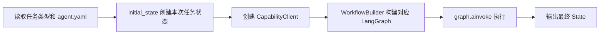
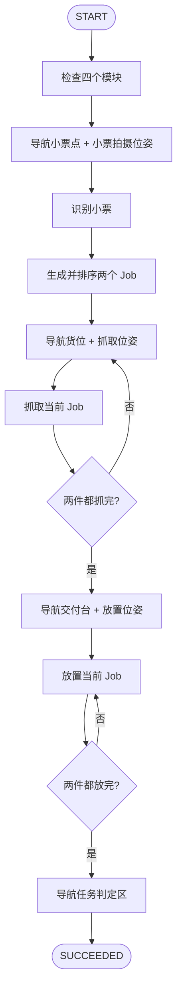
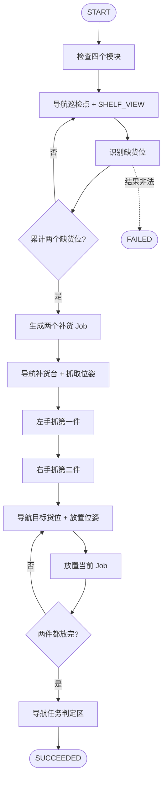
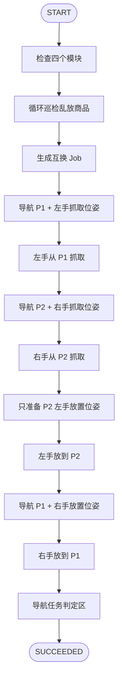

# 三项任务代码工作流核对说明

> 本文按当前 `src/agent` 实际代码整理，不是对设计文档的重复描述。  
> 需求依据：[能力模块划分与 Agent 接口规范](./能力模块划分与Agent接口规范.md)

## 1. 结论

|任务|当前实现结论|
|---|---|
|任务一：商品拣选 `SORTING`|主流程符合：识别两个商品，按路径顺序分配左右手，全部抓取后到交付台放置，最后返回判定区|
|任务二：货架补货 `SHORTAGE`|主流程符合：循环巡检并累计两个缺货位，到补货台双手抓取，再逐个货位补货|
|任务三：乱放归位 `MISPLACED`|符合：按左抓、右抓、左放、右放完成互换，P2 左手放置前只准备位姿|

审核时需要重点确认三项：

1. 任务一的路径排序由配置中的静态 `route_order` 决定，不是实时最短路径计算。
2. 当前 State 是满足三个固定流程的简化版，没有保存全部导航和位姿中间字段。
3. State 只在内存中，进程重启后不能恢复，也没有跨进程机器人执行锁。

## 2. 代码如何启动工作流

相关代码：

|文件|职责|
|---|---|
|[main.py](../src/agent/main.py)|读取任务类型和配置，创建初始 State，执行 LangGraph|
|[workflow.py](../src/agent/workflow.py)|定义节点、任务规则、Job 生成和流程路由|
|[client.py](../src/agent/client.py)|调用四个能力服务，处理超时、重试、幂等和响应校验|
|[models.py](../src/agent/models.py)|定义 State、Job、配置和错误类型|
|[agent.yaml](../config/agent.yaml)|服务地址、超时、巡检点和商品摆放表|

运行入口：

```bash
PYTHONPATH=src .venv/bin/python -m agent.main SORTING
PYTHONPATH=src .venv/bin/python -m agent.main SHORTAGE
PYTHONPATH=src .venv/bin/python -m agent.main MISPLACED
```

`main.py` 的公共启动过程是：



## 3. 公共状态和执行规则

### 3.1 State 和 Job

`WorkflowState` 只保存编排需要的数据：

|字段|用途|
|---|---|
|`task_run_id`、`task_type`、`status`|标识一次任务及其整体状态|
|`inspection_points/index/pass`|记录任务二、三巡检到哪里、当前第几轮|
|`findings`|小票或巡检得到的货位|
|`jobs`、`current_job_index`|待执行作业和当前游标|
|`held_items`|左右手当前持有的商品|
|`current_action_id/status`|最近一次物理动作|
|`error_code/message`|失败原因|

每个 `Job` 包含商品名、来源、目的地、使用的手，以及 `picked/placed` 完成标记。只有能力接口明确返回成功后，代码才更新持物和完成标记。

### 3.2 公共前置和结束条件

三个任务开始时并发调用 `/navigation/health`、`/perception/health`、`/pose/health` 和 `/manipulation/health`。四个模块全部为 `READY` 才进入业务流程。

三个任务结束时都执行 `finish`：

1. 检查所有 Job 已放置且 `held_items` 为空。
2. 调用导航接口前往 `task_boundary`。
3. 到达后进入 `success`，将状态设为 `SUCCEEDED`。

任一步失败都会进入统一的 `fail -> END`，不会继续下发后续动作。

### 3.3 长动作、重试和幂等

当前配置的读取超时为：感知小票 120 秒、货架巡检 180 秒、位姿 300 秒、导航/抓取/放置 600 秒。

导航、位姿、抓取和放置请求都携带：

```text
Idempotency-Key = task_run_id + ":" + action_id
```

连接或读取异常最多重试一次，并复用同一个键。明确的非 `2xx` 响应不重试。连续两次网络异常时，动作结果记为 `UNKNOWN`，整个任务停止，等待人工确认机器人现场状态。

## 4. 任务一：商品拣选

图构建函数：`WorkflowBuilder._build_sorting_graph()`。



实际步骤：

|步骤|代码节点|HTTP 调用|关键 State 变化|
|---:|---|---|---|
|1|`check_health`|四个模块各自的健康检查接口|全部就绪后继续|
|2|`prepare_receipt`|并行导航 `receipt_viewpoint`、位姿 `RECEIPT_VIEW`|准备识别小票|
|3|`parse_receipt`|`POST /receipt/parse`|两个不同有效货位写入 `findings`|
|4|`build_jobs`|无|按 `route_order` 排序，第一件 `LEFT`，第二件 `RIGHT`|
|5|`prepare_pick`|并行导航商品货位、位姿 `SHELF_PICK_READY`|准备当前 Job|
|6|`pick`|`POST /manipulation/pick`|`picked=True`，商品写入对应手|
|7|抓取循环|重复步骤 5、6|两个 Job 都抓完才离开货架|
|8|`prepare_delivery`|并行导航 `delivery_place`、位姿 `DELIVERY_TABLE_PLACE_READY`|放置游标回到第一个 Job|
|9|`place` 循环|每件一次 `POST /manipulation/place`|`placed=True`，清空对应手|
|10|`finish`|导航 `task_boundary`|成功后 `SUCCEEDED`|

Job 的来源是小票货位，目的地统一为 `delivery_place`。代码先按 `agent.yaml` 中各货位的 `route_order` 排序，再分配左右手。因此这里实现的是“场地预设路径顺序”，不是由导航模块实时计算两个货位的最短访问顺序。

## 5. 任务二：货架补货

图构建函数：`WorkflowBuilder._build_shortage_graph()`。



当前巡检点配置为：

```text
H1_F_INSPECT -> H1_B_INSPECT -> H2_F_INSPECT -> H2_B_INSPECT
```

点位数量、名称和列表顺序都可以修改。奇数轮按配置顺序巡检，偶数轮按相反顺序巡检；每次换轮的首点就是上一轮末点，所以该点只再次调用识别，不重复导航和 `SHELF_VIEW` 位姿准备。结果不足不会结束任务，Agent 会持续往返巡检。

实际步骤：

|步骤|代码节点|HTTP 调用|关键 State 变化|
|---:|---|---|---|
|1|`check_health`|四个模块各自的健康检查接口|全部就绪后继续|
|2|`prepare_inspection`|并行导航当前巡检点、位姿 `SHELF_VIEW`|准备观察当前货架面|
|3|`inspect`|`POST /areas/inspect`，`task_type=SHORTAGE`|校验、去重并累计到 `findings`|
|4|巡检条件边|不足两个则持续重复步骤 2、3|奇数轮正向、偶数轮反向；换轮首点只识别|
|5|`build_jobs`|无|为两个缺货位生成 Job，分配 `LEFT/RIGHT`|
|6|`prepare_replenishment`|并行导航 `replenishment_pickup`、补货台抓取位姿|到补货台|
|7|`pick` 循环|连续两次 `POST /manipulation/pick`|左、右手各持一件，不重复导航补货台|
|8|`prepare_place`|并行导航当前目标货位、位姿 `SHELF_PLACE_READY`|准备对应货架层|
|9|`place`|`POST /manipulation/place`|完成当前补货 Job|
|10|放置循环|第二件重复步骤 8、9|两个目标货位分别准备和放置|
|11|`finish`|导航 `task_boundary`|成功后 `SUCCEEDED`|

每个 Job 的来源是 `replenishment_pickup`，目的地是缺货货位，商品名通过本地摆放表反查。单次或累计结果超过两个会失败；结果不足时不失败，而是持续正反向巡检，直到累计得到两个有效缺货位或外部接口失败。

## 6. 任务三：乱放归位

图构建函数：`WorkflowBuilder._build_misplaced_graph()`。

感知结果固定解释为：

```text
P1 = 乱放商品当前所在货位
P2 = 该商品的标准货位
```

两件商品互换位置，因此代码生成两个固定 Job：

|Job|source|destination|hand|
|---|---|---|---|
|`job_0`：P2 对应商品|P1|P2|LEFT|
|`job_1`：P1 对应商品|P2|P1|RIGHT|



实际步骤：

|步骤|代码节点|HTTP 调用|关键 State 变化|
|---:|---|---|---|
|1|`check_health`|四个模块各自的健康检查接口|全部就绪后继续|
|2|`prepare_inspection`、`inspect`|导航巡检点、`SHELF_VIEW`、`POST /areas/inspect`|奇数轮正向、偶数轮反向；无结果持续巡检|
|3|`build_jobs`|无|按 P1/P2 关系生成上表两个 Job|
|4|`prepare_pick_left`、`pick_left`|导航 P1、抓取位姿、左手抓取|左手持有应去 P2 的商品|
|5|`prepare_pick_right`、`pick_right`|导航 P2、抓取位姿、右手抓取|右手持有应去 P1 的商品|
|6|`prepare_place_left`、`place_left`|只准备 P2 放置位姿，然后左手放置|P2 恢复正确商品|
|7|`prepare_place_right`、`place_right`|导航 P1、放置位姿、右手放置|P1 恢复正确商品|
|8|`finish`|导航 `task_boundary`|成功后 `SUCCEEDED`|

这张图没有使用通用循环，而是显式连接“左抓 -> 右抓 -> 左放 -> 右放”，因此抓放顺序不会被动态 Job 游标改变。

P2 右手抓取结束后机器人仍位于 P2，因此 `prepare_misplaced_place_left()` 只调用位姿接口，不再调用导航。右手商品需要放回 P1，后续 `prepare_misplaced_place_right()` 仍会并行执行导航 P1 和放置位姿准备。

## 7. 失败路由和规范差异

所有业务节点遵循同一条件边：

```text
节点成功 -> 下一节点
节点失败 -> fail -> END
```

以下情况都会停止任务：模块未就绪、响应结构非法、货位不在摆放表、巡检数量不符合规则、抓放前置条件不满足、接口明确失败，或重试后仍无法确认物理动作结果。

当前代码与规范需要确认的差异汇总：

|项|规范/期望|当前代码|
|---|---|---|
|任务一路径|“按路径排序”|使用本地静态 `route_order`|
|State 字段|规范列出导航目标、导航状态、位姿请求/状态等字段|当前节点直接派生这些参数，没有长期保存|
|异常恢复|规范没有明确进程恢复方案|仅内存 State，进程退出后本次任务丢失|
|并发控制|一台机器人同时执行一个任务|当前没有跨进程锁，两个 CLI 可同时启动|

任务一路径排序直接影响业务决策，需要确认。其余项目不影响单次正常试跑，但会影响现场诊断、进程异常恢复和误启动防护。

## 8. 如何验证

自动化测试在 [test_workflow.py](../tests/test_workflow.py)，覆盖三个成功流程、健康检查失败、非 `2xx`、超时重试、未知结果、第三轮继续巡检和长动作超时。

```bash
.venv/bin/pytest -q
```

也可以先启动四端口 Mock，再分别按正式入口运行三个任务：

```bash
# 终端一
PYTHONPATH=src .venv/bin/python -m agent.mock_server --scenario success

# 终端二
PYTHONPATH=src .venv/bin/python -m agent.main SORTING
PYTHONPATH=src .venv/bin/python -m agent.main SHORTAGE
PYTHONPATH=src .venv/bin/python -m agent.main MISPLACED
```

最终 State 中 `status=SUCCEEDED`、所有 Job 的 `picked/placed=true`、`held_items={}`，表示编排流程完整结束。
