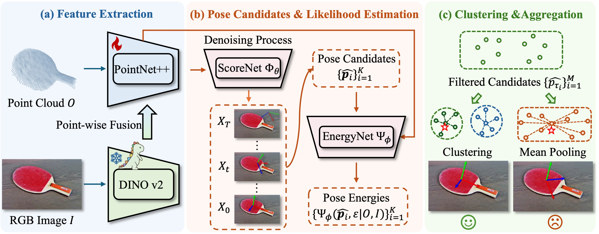

# GenPose++
[](https://jiyao06.github.io/Omni6DPose/)
[](https://arxiv.org/pdf/2406.04316.pdf)
[](https://jiyao06.github.io/Omni6DPose/download/)
[](https://github.com/Omni6DPose/Omni6DPoseAPI/)
[](https://jiyao06.github.io/Omni6DPose/cutoop/)
[](https://github.com/Omni6DPose/GenPose2/blob/main/LICENSE)
[](https://hits.seeyoufarm.com)

The official implementation of GenPose++, as presented in [Omni6DPose](https://jiyao06.github.io/Omni6DPose/). (ECCV 2024)




## ✨ News
* **2025.08.01**: **A convenient version of GenPose++ with SAM** is released! 🎉
* **2024.08.10**: **GenPose++** is released! 🎉
* **2024.08.01**: **<span style="color: #9AEA27;">Omni6DPose</span>** [dataset](https://github.com/Omni6DPose/Omni6DPoseAPI) and [API](https://github.com/Omni6DPose/Omni6DPoseAPI) are released! 🎉
* **2024.07.01**: **<span style="color: #9AEA27;">Omni6DPose</span>** has been accepted by ECCV2024! 🎉


## 📆 TODO
- [x] Release the Omni6DPose dataset. 
- [x] Release the Omni6DPose API.
- [x] Release the GenPose++ and pretrained models.
- [x] Release a convenient version of GenPose++ with SAM for the downstream tasks.


## ⚙️ Requirements
- Ubuntu 20.04
- Python 3.10.14
- Pytorch 2.1.0
- CUDA 11.8
- 1 * NVIDIA RTX 4090


## 🔨 Installation

- ### Create Environment

```bash
conda create -n genpose2 python==3.10.14
conda activate genpose2
```

- ### Install pytorch

``` bash
conda install cudatoolkit=11
pip install torch==2.1.0 torchvision==0.16.0 torchaudio==2.1.0 --index-url https://download.pytorch.org/whl/cu118
```

- ### Install from requirements.txt

``` bash
pip install -r requirements.txt 
```

- ### Compile pointnet2

``` bash
cd networks/pts_encoder/pointnet2_utils/pointnet2
python setup.py install
```

- ### Compile Cutoop
We provide `cutoop`, a convenient tool for the Omni6DPose dataset. We provide two ways to install it. The detailed installation instructions can be found in the [Omni6DPoseAPI](https://github.com/Omni6DPose/Omni6DPoseAPI/). There we provide the installation instructions using the `pip` package manager.

```bash
sudo apt-get install openexr
pip install cutoop
```

## 🗂️ Download dataset and models

- Download and organize the Omni6DPose dataset by following the instructions provided on the [Omni6DPoseAPI](https://github.com/Omni6DPose/Omni6DPoseAPI) page. Note that the `PAM` dataset and the files `depth_1.zip`, `coord.zip`, and `ir.zip` from the `SOPE` dataset are not required for GenPose++. You may omit downloading these files to save disk space.

- Copy the files from `Meta` to the `$ROOT/configs` directory. The organization of the files should be as follows:

``` bash
genpose2
└──configs
   ├── obj_meta.json
   ├── real_obj_meta.json
   └── config.py
```

- We provide the trained [checkpoints](https://www.dropbox.com/scl/fo/x87lhf7sygjm1gasz153g/AIHBlaGMjhfyW1bKrDe61R4?rlkey=y1f6dqdi40tzcgepccthayudp&st=1sbkxbzf&dl=0). Please download the files to the `$ROOT/results` directory and organize them as follows:

``` bash
genpose2
└──results
   └── ckpts
       ├── ScoreNet
       │   └── scorenet.pth
       ├── EnergyNet
       │   └── energynet.pth
       └── ScaleNet
           └── scalenet.pth
```

## 🚀 Training

Set the parameter `--data_path` in `scripts/train_score.sh`, `scripts/train_energy.sh` and `scripts/train_scale.sh` to your own path of SOPE dataset.

- ### Score network

  Train the score network to generate the pose candidates.

``` bash
bash scripts/train_score.sh
```

- ### Energy network

  Train the energy network to aggragate the pose candidates.

``` bash
bash scripts/train_energy.sh
```

- ### Scale network
  Train the scale network to predict the bounding box length. 
  
  The scale network uses the features extracted by the score network.  You may need to change the parameter `--pretrained_score_model_path` in `scripts/train_scale.sh` if you have trained your own score network.

``` bash
bash scripts/train_scale.sh
```

## 🎯 Inference and evaluation

Set the parameter `--data_path` in `scripts/eval_single.sh` to your own path of ROPE dataset.

- ### Evaluate pose estimation performance

``` bash
bash scripts/eval_single.sh
```

- ### Evaluate pose tracking performance

``` bash
bash scripts/eval_tracking.sh
```

- ### Single video inference and visualization
``` bash
python runners/infer.py
```

## 📷 Real-time camera stream inference
Here we provide a script for real-time camera stream inference with the segmentation masks from [SAM2](https://github.com/Gy920/segment-anything-2-real-time). 

- ### Installation
  First you have to download [SAM2](https://github.com/Gy920/segment-anything-2-real-time) to the base directory, and follow the instruction download the checkpoint `sam2.1_hiera_tiny.pt`.

```bash
pip install -r requirements.txt
```

- ### Inference with RealSense D415 camera
1. Set the `USE_CAM` in the `runners/infer_camera.py` file to `True`. If you want to save the camera stream, set `SAVE_CAM` to `True`.
2. Fill in your camera's serial number in the `CAM_SERIAL_NUM`.
3. If you want to save the inference results, set the `SAVE_RES` to `True`. But note that the inference speed may be affected.
4. The `TRACKING` parameter is used to determine whether use tracking, which means use the pose in last frame as the initial pose. The `TRACKING_T0` parameter is to choose the tracking level. For more details, please see the comments in `runners/infer_camera.py` at the `PARAMETERS` part.
5. Run the script:
``` bash
python runners/infer_camera.py
```

- ### Inference with video stream
1. Download the example data [here](https://www.dropbox.com/scl/fo/o09kj5r1b2bidxsuimh70/AJ9xfeHBMVeLhjUC1HFoqAk?rlkey=wpnyxr17gl1c5enwv0zojqd9f&st=47o4ksfz&dl=0) to `results`, and organize the data structure as follows:
``` bash
results
└── infer_res/0001/video_stream
    ├── *_color.png
    ├── *_depth.exr
    ├── *_mask.exr
    └── *_meta.json
```
2. Set the `USE_CAM` and `SAVE_CAM` in the `runners/infer_camera.py` file to `False`.
3. The other parameters can be the same as [Inference with RealSense D415 camera](#inference-with-realsense-d415-camera).
4. Run the script:
``` bash
python runners/infer_camera.py
```

## 🔖 Citation

If you find our work useful in your research, please consider citing:

``` bash
@article{zhang2024omni6dpose,
  title={Omni6DPose: A Benchmark and Model for Universal 6D Object Pose Estimation and Tracking},
  author={Zhang, Jiyao and Huang, Weiyao and Peng, Bo and Wu, Mingdong and Hu, Fei and Chen, Zijian and Zhao, Bo and Dong, Hao},
  booktitle={European Conference on Computer Vision},
  year={2024},
  organization={Springer}
}
```

## 🖥️ Gradio UI（SAM3 / GenPose2）

本地可视化页签（默认端口 **18090**）：

| 页签 | 功能 |
|------|------|
| **SAM3 分割** | 文本提示分割 → mask / bbox / 实例点云 GLB |
| **SAM3 + GenPose2** | SAM3 → GenPose2 6D 位姿 → 叠加图 / 抓取位姿框（`xyzrxryrz` mm/° + 目标正方体）/ `poses.json` / `grasp_pose.json` / 坐标轴 GLB；支持 VLM 根据 RGB + 商品中文名生成实例分割提示词 |
| **缺货商品位姿估计** | 缺货名（MiniMax-M3）→ SAM3 提示词（qwen3-vl）→ SAM3 → GenPose2（含 `grasp_pose.json` / `poses.json`）→ 空间先验+M3 选型/位移 → 目的 6D（品红 GLB） |

```bash
# start.sh 会主动 conda activate genpose2，并打印 conf.json 依赖探测日志
# 请先启动依赖服务：SAM3（默认 :18003）、VLM sam3_prompt（默认 :8000）、远程 reason 可用
bash start.sh start|stop|restart|status
# UI: http://<host>:18090/
# 日志: logs/ui.log
```

配置：`config/conf.json`（`sam3` API、双 VLM profile、`genpose2` 三网权重）。产物：`output/ui_runs/`（含 `grasp_pose.json`、`place_destination.json`）。

**抓取位姿展示**（SAM3 + GenPose2 / 缺货商品位姿估计页签）：对齐 Gen6D 摘取点格式，JSON 框输出 `xyzrxryrz = [x,y,z,rx,ry,rz]`（mm / °，ZYX），并含目标空间正方体 `size_3d` / `size_3d_mm` / 8 角点 `corners_mm`；同内容写入运行目录 `grasp_pose.json`。缺货页签的 Gradio 输出与 `run_sam3_genpose_tab` 的 10 项对齐（含 grasp），再接放置目的可视化。

**提示词 / VLM**（`scripts/vlm_prompt.py`）：
- `vlm.sam3_prompt`：本地 **qwen3-vl-4b**（OpenAI `chat/completions`）生成 SAM3 提示词
- `vlm.reason`：**MiniMax-M3**（Anthropic 兼容）做缺货识别与放置位移；Key 用 `ANTHROPIC_API_KEY` 或 `config/secrets.local.json`（已 gitignore）
- 缺货识别默认文案：`vlm.missing_prompt`

**放置目的位姿**：把同款实例 mask + `xyz_mm` 与识别对话喂给 M3；并用列/前排深度空间先验校正「飞出货架」的位移。实现见 `ui/place_missing.py`。

**Depth→RGB 对齐**：UI 默认开启，将 Depth warp 到 RGB 网格后再推理/叠加，修正 RGB-D 横向偏差（历史 `dx=-45` 约定会转为 Depth 右移 45）；也可用 `camera.json` 的 `depth_to_rgb_shift` / `rgb_shift`。

## 独立 HTTP 服务推理测试前端

`run_service_frontend.py` 提供一个不加载 SAM3 或 GenPose2 模型的独立测试页面。它只通过 HTTP 调用已经运行的服务，默认地址为：

- SAM3：`http://127.0.0.1:18003/infer`
- 位姿估计：`http://127.0.0.1:8084/manipulation/pick_pose`
- 前端：`http://<host>:18086/`

启动：

```bash
/home/ubuntu/miniconda3/envs/genpose2/bin/python run_service_frontend.py \
  --host 0.0.0.0 --port 18086
```

页面接收 RGB、Depth、camera.json（或完整手工 `fx/fy/cx/cy/depth_scale`），通过两次点击生成矩形框。可分别运行 SAM3、使用当前掩码运行位姿估计，或执行完整流程。输出包括掩码、深度伪彩色、2D 位姿与 `corners_mm` 立方体、交互式点云 GLB、PLY、原始 JSON 和每个流程耗时。

前端不会启动、停止或重启任何后端，也不会导入 PyTorch。SAM3 或 GenPose2 离线时，页面保持可用并显示调用错误；后续阶段失败时保留已经成功的前序结果。位姿 URL 可直接改为 `/manipulation/place_pose`，请求仍严格使用 `rgb`、`depth`、`camera`、`mask` 四个 multipart 文件。

## 📮 Contact

If you have any questions, please feel free to contact us:

[Jiyao Zhang](https://jiyao06.github.io/): [jiyaozhang@stu.pku.edu.cn](mailto:jiyaozhang@stu.pku.edu.cn)

[Weiyao Huang](https://github.com/sshwy): [sshwy@stu.pku.edu.cn](mailto:sshwy@stu.pku.edu.cn)

[Bo Peng](https://github.com/p-b-p-b): [bo.peng@stu.pku.edu.cn](mailto:bo.peng@stu.pku.edu.cn)

[Hao Dong](https://zsdonghao.github.io/): [hao.dong@pku.edu.cn](mailto:hao.dong@pku.edu.cn)

## 📝 License

This project is released under the MIT license. See [LICENSE](LICENSE) for additional details.
